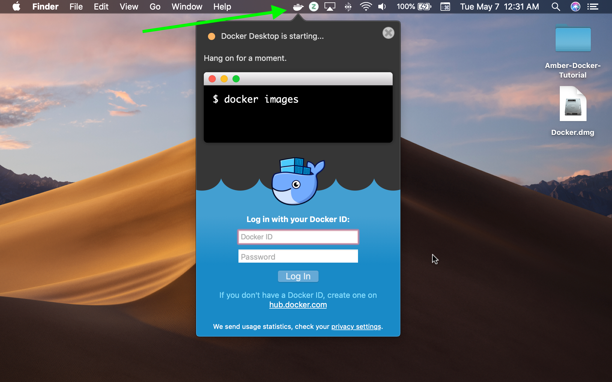
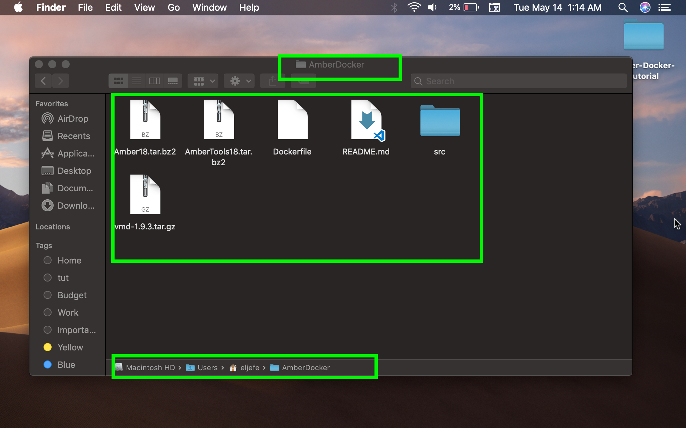

// global variables for admonition icons 
:tip-caption: pass:[<span style="font-size: em">TIP 💡</span]
:note-caption: pass:[<span style="font-size: em">  NOTE ✏️ </span]
:important-caption: pass:[<span style="font-size: em"> IMPORTANT ❗ </span]


// document Title 
= Containerization: A Simplified Approach for Accessing Amber Molecular Dynamics Software on Your Mac
Dylan Torres <dylan.l.torres@ucdenver.edu>
//table of contents
:toc:
// attribute for displaying keyboard
:experimental:
:commandkey: &#8984;

NOTE: All references made to `Terminal.app` indicate the use of the native Unix shell on macOS. If you're unfamilar with the shell, check out this http://swcarpentry.github.io/shell-novice/[tutorial].

== The Challenges of Computational Software Packages

Computation has revolutionized how researchers do science. Compared to tranditional methods, computation offers improvements in safety, efficiency, and cost. However, for the vast majority of curious minds, computational software packages (CSPs) have a major downfall - they are difficult to access. The challenge to access CSPs can be characterized by two factors: they lack portability and they are resource intensive. 

At the core of every computer's operating system is the https://en.wikipedia.org/wiki/Kernel_(operating_system)[kernel]. macOS utlizes the XNU (Darwin) kernel and Windows utilizes the NT kernel. Despite the popularity of the previously mentioned operating systems, many CSPs are developed for the https://en.wikipedia.org/wiki/Linux_kernel[Linux kernel]. Attempting to install or run Linux-based applications on macOS or Windows can result in failure due to https://en.wikipedia.org/wiki/Software_incompatibility[system incompatibilities]. Hence, CSPs lack portability. 

All applications and software must have a proper environement to install and run in. This inludes source code, libraries and other applications - all of which are called http://rcardin.github.io/programming/oop/software-engineering/2017/04/10/dependency-dot.html[dependencies]. Additionally, all applications and software have to communicate with the kernel to execute specific tasks  as instructed by the user. This is where https://en.wikipedia.org/wiki/Compiler[compilers] come in. CSPs have lots of dependencies and can require several compilers - which summed together are resource intensive, compromsing a computer's speed and performance. 

Fortunately, these challenges can be simplified by running a CSP in a https://www.docker.com/resources/what-container[container]. 
The following text contains instructions on how to install and run a Linux-based, molecular dynamics (MD) package called http://ambermd.org[Amber] on your Mac. We will utilize a containerization platform known as https://docs.docker.com/install/[Docker] to accomplish this.
****
IMPORTANT: Amber is currently comprised of two packages: AmberTools18 and Amber18. AmberTools18 is free but Amber18 requires a purchased license.
****

== Docker Desktop for Mac

*Docker Desktop* is the  latest version of Docker. This is the platform that we will use to run a containerized version of Amber. But first, we need to verify that your Mac can support Docker Desktop. 

****
[NOTE]
.If Your Mac *CANNOT* support Docker Desktop:
====
An older version of Docker called https://docs.docker.com/toolbox/overview/[Docker Toolbox] may be installed. However, be aware that Docker Toolbox was not tested for running a containerized version of Amber.
====
****

=== Docker Desktop: System Requirements for Macs

Verify that the following System Requirmenents are satisfied.

.System Requirements for Running Docker Desktop on a Mac

|===
| Hardware | Version (macOS) | VirtualBox

| 2010 models or later | Sierra 10.12 or later (later versions recommended).| *IF* VIrtualBox *IS NOT* installed on your Mac: your're good, there's no need to install it.


|4 GB of RAM or more|
|*IF* VirtualBox *IS* installed on your Mac: VirtualBox must be version 4.3.30 or later. |

|===

=== Determine If Virtualization Is Supported On Your Mac

****
TIP: Quickly access `Terminal.app` and more with Spotlight Search. Press kbd:[ {commandkey} + space] and type `terminal` in the Spotlight Search box. 
****

Docker Desktop for Mac requires that your central processing unit (CPU) can run a *_hypervisor_* (a virtualized version of the Linux kernel). 

To deterimine if virtualization is supported on your Mac, let's run a https://en.wikipedia.org/wiki/System_call[system call] using the `sysctl` command (prounounced: SIS-kun-troll). 

****
[NOTE]
.sysctl command: Get Kernel State
====

```sh
sysctl [OPTIONS] [variable[=value]] [...]
```
====
****

Enter the following shell prompt in `Terminal.app`: 

```sh
$ sysctl kern.hv_support
```


If virtualization is enabled and available on your Mac, you will see the following output:

```sh
$ sysctl kern.hv_support
kern.hv_support: 1
```

If virtualization is not unsupported, you will receive the following output:

```sh
$ sysctl kern.hv_support
kern.hv_support: 0
```

.Example of a hypervisor supported Mac. 
image::DockerVerification.png[Supported System]

=== Docker Desktop: Installation Instructions

Follow these instructions to install Docker Desktop on your Mac. 

. Download https://download.docker.com/mac/stable/Docker.dmg[Docker Desktop].
+
****
[NOTE]
.File Extensions
====
`.dmg` files are specific to macOS. They're compressed versions of applications that are mounted as drives on your Mac, making their content easy to view and install. 
====
****
+
. Double-click `Docker.dmg` to open the installer.
+
image::docker-install00018.png[]
+
. Drag the whale to the Applications folder.
+

+
. Double-click `Docker.app` in the Applications folder to start Docker. Or, you can easily access the app by using Spotlight Search.  Press kbd:[{commandkey} + space] and type `Docker` and select `Docker.app`.
+
image::docker-install00013.png[]
+
****
[IMPORTANT]
.*System Preferences*
====
macOS automatically blocks the installation of apps that are not downloaded from the AppStore. Follow the proceding steps to bypass these settings.
====
****

. If the folowing window appears, click "OK."
+
image::ddfm10.png[]
+
. Click the Apple icon in the menu bar and select "System Preferences." 
+ 
image:docker-install00004.png[]
+
. Click the grid icon in the upper-left corner to "Show All (options)." Then click  "Security and Privacy."
+

+
. Under the "General" tab in "Security and Privacy," click on the "Lock" in the bottom left corner to "Make Changes." Enter your system password and then click "Open Anyway."   
+

+
. Authorize `Docker.app` with your system password after Docker is launched.
+

+
. A new window will appear prompting you to create a DockerHub account - create an account.
+

+
****
[NOTE] 
.Docker Runs in the Background
====
Cick on the whale icon in the Task Bar when you wish to quit Docker.
====
****

.Quit Docker Desktop Using the Whale Icon in the Task Bar


== Build an Image 

To run molecular dynamics simulations in a container, we have to *build* an *executable* package of software called a *_container image_*, or simply, an *_image_*. 

But to ensure that the image is built with the correct compilers and dependencies, we need a `DockerFile` and *context*. 

=== Getting Build Instructions: Dockerfile and README

In the following steps we will get instructions from a developer who designed the containerized version of Amber that we will run. 

An example of the command-line-interface of the following steps is displayed in Figure 2. 

. In `Terminal.app`, clone the `AmberDocker` repository from the developer:
+
```sh
$ git clone https://github.com/yylonly/AmberDocker.git
```
+
. List the files in your current directory. A new local repository (directory) called `AmberDocker` should be present. 
+
```sh 
$ ls
AmberDocker
```
+
. Change directories to  `/AmberDocker`. 
+
```sh
$ cd AmberDocker
AmberDocker $
```

. List the files in the `AmberDocker` directory:
+
****
[NOTE]
.File Extensions
====
`README.md` files are instructions from the developer to the user, written with a program called MarkDown. These instructions direct us on how to set up the environment (context) to build an image. 

`Dockerfile` is a set of image-building instructions from the developer to  Docker daemon.  
====
****

+
```sh
$ ls
README.md	 Dockerfile		src     	
```

. Open the `README.md` file and `Dockerfile` to get an better idea of how to set up context and to see how `Dockerfiles` are written. 
+
****
TIP: You'll need a text editor to view a formatted `.md` file. You can also view it https://github.com/yylonly/AmberDocker/blob/master/README.md[here]. However, as you become more experienced, you'll benefit from having a text editor like https://code.visualstudio.comhttps://code.visualstudio.com[Visual Studio Code].
****

+
```sh
$ open README.md
$ open Dockerfile
```
+
[#img-Image Build Setup]
.Example of Steps 1-5.
image::image-setup00001.png[]
+
. Don't rely on the `README.md` file for setting up the build context. The `README.md` instructions have been optimized for Mac users and are presented in the next section. 

=== Setting Up to Build: Context and Dependencies

In order to fully run Amber, we need compressed `TAR` files for both AmberTools18, and Amber18 as well as several other dependencies. Below are the steps for setting up the context to build our image. 

****
[NOTE]
.File Extensions
====
`.tar` files store multiple files in one and are primarily used to archive in Linux/Unix systems. 

`.bz2` files are used to compress TAR files (and others) for quick and easy software distribution. 
====
****

. *Download Amber*
* *AmberTools18 (Open Source)*
** Download http://ambermd.org/GetAmber.php#ambertools[AmberTools18]. The recommended download method is *Option 1: Getting the Source Code*. 
Fill out the required fields to get the `AmberTools18.tar.bz2`. 
** Store `AmberTools18.tar.bz2` in the `/AmberDocker` directory.
* *Amber18 Source Code (License Required)*
** After purchasing a license (or obtaining one from school/work) for http://ambermd.org/GetAmber.php#ambertools[Amber18], follow the `Amber18.tar.bz2` download instructions sent to you. 
** Store `Amber18.tar.bz2` in the `/AmberDocker` directory.
. *Download VMD 1.9.3*
* Download https://www.ks.uiuc.edu/Research/vmd/vmd-1.9.3[VMD-1.9.3] for "MacOS X, Unix or Windows."
+
image::vmd00005.png[]
+
* Select "Linux_64 OpenGL..."
+

+
* Create a username and password. Then click "Continue with registration or download."
+
image::vmd00003.png[]
+
* After answering several questions, click "I am... I agree to the terms of this license."
+

+
* Rename the file to `vmd-1.9.3-tar.gz`.
* Store `vmd-1.9.3-tar.gz` in the  `/AmberDocker` directory 
. *Install Real VNC*
+
****
IMPORTANT: If you experience any diffulties with installing Real VNC, adjust the *System Preferences* settings as previously described in the *Docker Desktop* installation instructions.
****
* Download and install https://www.realvnc.com/download/file/viewer.files/VNC-Viewer-6.19.325-MacOSX-x86_64.dmg[VNC Viewer]. This will provide us with an https://en.wikipedia.org/wiki/Ubuntu[Ubuntu] Graphical User Interface (GUI) to interact with the container. 
+


=== Double-Check: Context Verification

Before proceeding, verify that the following files are in the `/AmberDocker` directory and correctly named. 

* `AmberTools18.tar.bz2`
* `Amber18.tar.bz2` 
* `vmd-1.9.3.tar.gz`

Your directory should look the same as the figure below. 

.Correct setup of the `/AmberDocker` Directory


=== Build an Image: Docker Build Command

Now that we have our `Dockerfile` and context setup, it's time to *build*! 

****
[NOTE]
.Docker Build Command: Build an Image From a Dockerfile and Context
====

```sh
docker build [OPTIONS] PATH | URL | -
```
====
****

In the `/AmberDocker` directory of `Terminal.app`, enter the following command:

```sh
$ docker build . -t amber18:cpu
```

//Table 1
.Making Sense of the Docker Build Command
|===
|Name/Shorthand | Usage |Meaning

| `.` | sets the `PATH` to the current directory| The directory `/AmberDocker`, contains the `Dockerfile` and context (source-code and dependencies) from which the image will be built

|`--tag , -t` | name and tag an image | The image is named and tagged as `amber18:cpu`

|===

After entering the `docker build` command, instructions from the `Dockerfile` are sent to `Docker daemon`. 

.Sending build context to Docker daemon. 
image::docker-build1.png[]

As `Docker daemon` completes each step in the `Dockerfile`, an output is displayed in `terminal.app`. In total, there are 44 steps. The build time is about an hour for the `amber18:cpu` image. You will be notified upon successful completion of the build.

.Successfuly built image tagged as `amber18:cpu`. 
 

****
[IMPORTANT]
.Build Errors
====
If you are experiencing difficulties with building the image, verify that the files within the `/AmberDocker` directory are exactly the same as in Figure 4.
====
****

== Run a Container

Now that we have built our image, it's time to *run* Amber in a *container*!

=== Run a Container: Docker Run Command

Docker builds images _recursively_. This means that images can be run from nearly any directory on your computer. 

The image `amber18:cpu` already contains the dependencies and compilers required to run Amber. The directory in which you choose to run the container, depends on the files you wish to access in the container.

****
[NOTE]
.Docker Run Command: Run an Image in a Container
====
```sh
docker run [OPTIONS] IMAGE [COMMAND] [ARG...]
```
====
****

Let's run the image `amber18:cpu` as a container with the `docker run` command. In `terminal.app` enter:

```sh
$ docker run --rm -p 5901:5901 -p 6901:6901 -v $(pwd):/data --user 0  amber18:cpu
```


// Table 
.Making Senese of the Docker Run Command
|===
|Name/Shorthand | Usage |Meaning

| `-rm` |Automatically removes the container after it is exited.|

|`-p` |Publish a container's port(s) to the host|Assigning ports allows us to access the container from other applications. To learn more about ports, check out this https://www.youtube.com/watch?v=zCAyinelie0&t=260s[video]. 

|`--volume , -v` |Mounts volumes from the specified container(s)| Whatever files/directories are located within the current working directory `$(pwd)`, will be accessible in the `/data` directory in the container

|`--user` |Username or UID of a Linux kernel| `0` indicates that you are the superuser of the container

|===

You should have received an output similar to the Figure 6. 

.Output From the Docker Run Command


Let's focus on a segment of the output:

```sh

------------------ VNC environment started ------------------

VNCSERVER started on DISPLAY= :1 
	=> connect via VNC viewer with 172.17.0.2:5901

noVNC HTML client started:
	=> connect via http://172.17.0.2:6901/?password=...

/Users/eljefe/AmberDocker 
```

The output informs us that there are two ways in which we can connect to the container: `connect via VNC Viewer` and `connect via http:/...`. These methods are summarized in Table 5 and demonstrated in the following sections. 

.Making Sense of the Docker Run Output
|===
| Method| Access Container With: | Port | Input | Password

|Method 1| `VNC Viewer.app` | 5901 |`:1` |  `vncpassword`

|Method 2 | `safari.app` | 6901 | `localhost:6901` |`vncpassword`

|===

=== Accessing the Container: VNC Viewer

. Open `VNC Viewer.app`. 
+

+
. Enter `:1` in the Search bar to connect to the hosted port `localhost::5901`.
+

+
. Enter the password `vncpassword` to authenticate the connection.  
+

+
. Congratulations! You're officially running a container with AmberTools18 and Amber18 installed. 
+

+
You can verify that dependencies of Amber are all contained in the file system of the container. 
+


=== Accesing the Container: Safari

. Open `Safari.app` and type `localhost:6901` in the search bar. 
+

+
. Enter the password `vncpassword` to authenticate the connection. 
+

+
. Congratulations! You're officially running a container with AmberTools18 and Amber18 installed. 
+

