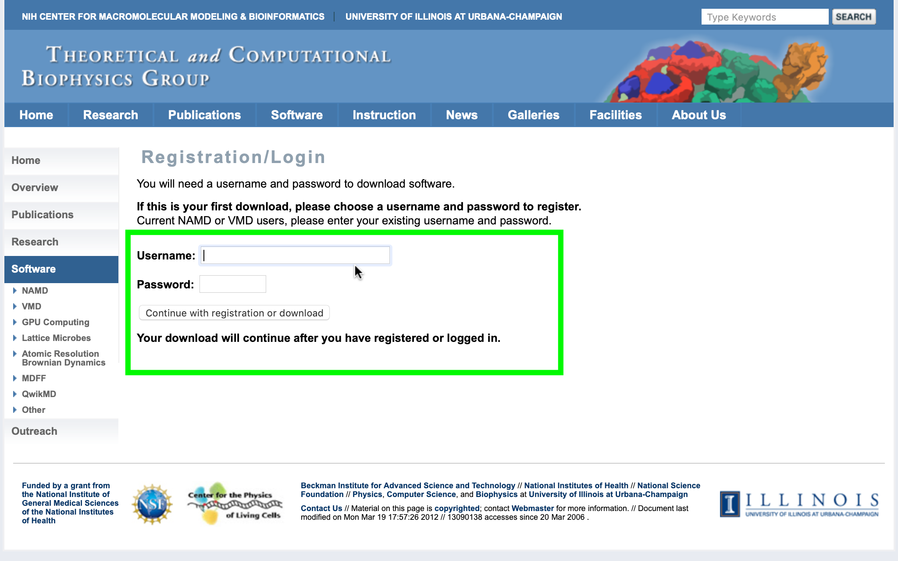

// global variables for admonition icons 
:tip-caption: pass:[<span style="font-size: em">TIP 💡</span]
:note-caption: pass:[<span style="font-size: em">  NOTE ✏️ </span]
:important-caption: pass:[<span style="font-size: em"> IMPORTANT ❗ </span]


// document Title 
= Containers: Run Comutation Software On Your Mac
Dylan Torres <dylan.l.torres@ucdenver.edu>
//table of contents
:toc:
//attribute for displaying keyboard
:experimental:
:commandkey: &#8984;


NOTE: All references made to `Terminal.app` indicate use of the Unix shell on macOS. If you're unfamilar with the shell, check out this http://swcarpentry.github.io/shell-novice/[tutorial].


== The Challenges of Computational Software
****
TIP: To easily access `Terminal.app`, press kbd:[ {commandkey} + space] and type `terminal` in the Spotlight Search box. 
****


I recently installed a molecular dynamics (MD) package called http://ambermd.org[Amber] on my Mac.  I'll show you how to do the same and hopefully you'll be conducting MD
simulations at the no time!

****
IMPORTANT: Amber is comprised of two packages. The first package, called AmberTools, is open-source (*free*). The second package, simply called Amber, requires a *purchased* license.
****

== Docker Desktop for Mac

To run MD simulations in a container, you'll need the latest version of Docker: *Docker Desktop*. 
****
[TIP]
====
You can verify that your Mac supports Docker Desktop by entering the following in `Terminal.app`: 
```sh
$ sysctl kern.hv_support
```
If supported, you will receive `1`:

```sh
kern.hv_support: 1
```

image::DockerVerification.png[Supported System]

If unsupported, you will receive `0`:

```sh
kern.hv_support: 0
```
====
****

=== Docker Desktop: System Requirements for Mac

If your system is unsupported, verify that the following requirements are met:

* *Hardware*:
** 2010 models or later
** RAM: 4 GB of RAM or more
* *Operating System (macOS)*:
** Sierra 10.12 or later (later versions recommended)
* *VirtualBox*:
** *IF* VIrtualBox *IS NOT* installed on your Mac:
*** Your're good, there's no need to install it.
** *IF* VirtualBox *IS* installed on your Mac:
*** VirtualBox must be version 4.3.30 or later

****
[NOTE]
.If Your Mac *IS NOT* supported:
====
An older version of Docker called https://docs.docker.com/toolbox/overview/[Docker Toolbox] *_might_* support your Mac. However, Docker Toolbox was not tested for running Amber in a container. 
====
****

=== Installing Docker Desktop

****
[NOTE]
.File Extensions
====
`.dmg` files are specific to macOS. They're compressed versions of applications that are mounted as drives on your Mac, making their content easy to view and install. 
====
****

. Download https://download.docker.com/mac/stable/Docker.dmg[Docker Desktop].
. Double-click `Docker.dmg` to open the installer.
+

+
. Drag the whale to the Applications folder.
+
image::docker-install00016.png[]
+
. Double-click `Docker.app` in the Applications folder to start Docker. Or, you can easily access the app by using Spotlight Search.  Press kbd:[{commandkey} + space] and type `Docker` and select `Docker.app`.
+

+
****
[IMPORTANT]
.*System Preferences*
====
macOS automatically blocks the installation of apps that are not downloaded from the AppStore. Follow the proceding steps to bypass these settings.
====
****
. If the folowing window appears, click "OK."
+

+
. Click the Apple icon in the menu bar and select "System Preferences." 
+ 

+
. Click the grid icon in the upper-left corner to "Show All (options)." Then click  "Security and Privacy."
+
image::Screen Shot 2019-05-07 at 1.36.44 AM.png[]
+
. Under the "General" tab in "Security and Privacy," click on the "Lock" in the bottom left corner to "Make Changes." Enter your system password and then click "Open Anyway."   
+
image::ddfm3.png[]
+
. Authorize `Docker.app` with your system password after Docker is launched.
+

+
. A new window will appear prompting you to create a DockerHub account - create an account.
+
image::docker-install00007.png[]
+
****
[NOTE] 
.Docker Runs in the Background
====
See the whale icon in your task bar? Cick on the icon when you wish to quit Docker.
====
****

image::Screen Shot 2019-05-07 at 1.19.09 AM.png[]

== Build an Image 

To run our MD container, we have to build an *executable* package of software called a *_container image_*, or simply, an *_image_*. An image will include everything that we need to run Amber: source-code, dependencies, and compilers.  

=== Build an Image: Getting Started
The following steps are displayed in  *_Figure 1_* below.

. Download files from the developer. In `Terminal.app`:
+
```sh
$ git clone https://github.com/yylonly/AmberDocker.git
```

. List (`ls`) the files in your current directory. A new directory called `AmberDocker` should be present. Change (`cd`) to the `/AmberDocker` directory . 
+

```sh 
$ ls
AmberDocker
$ cd AmberDocker
AmberDocker $
```

. List `ls` the Developer's prepackaged files in the `/AmberDocker` directory:
+
****
[NOTE]
.File Extensions
====
`README` files are instructions from the Developer to the User.

`.md` files are text files written with a text editor called MarkDown. 

`Dockerfile` contains the code written by the Developer for the Docker Daemon to build the image. 
====
****

+
```sh
$ ls
README.md	 Dockerfile		src     	
```

. Now, open the `README.md` file to view the developer's instructions on how to build the image:
+
****
TIP: You'll need a text editor to view a formatted `.md` file. You can also view it https://github.com/yylonly/AmberDocker/blob/master/README.md[here]. However, as you become more experienced, you'll benefit from having a text editor like https://code.visualstudio.comhttps://code.visualstudio.com[Visual Studio Code].
****
+
```sh
$ open README.md
```

[#img-Image Build Setup]
.Image Build Setup: Steps 1-4 

****
NOTE: For a streamlined approach, I've optimized the `README.md` instructions below. 
****

=== Build an Image: Getting Dependencies
****
[NOTE]
.File Extensions
====
`.tar` files store multiple files in one and are primarily used to archive in Linux/Unix systems. 

`.bz2` files are used to compress TAR files (and others) for quick and easy software distribution. 
====
****

. *Download Amber*
* *AmberTools18 (Open Source)*
** Download http://ambermd.org/GetAmber.php#ambertools[AmberTools18]. The recommended download method is *Option 1: Getting the Source Code*. 
Fill out the required fields to get the `AmberTools18.tar.bz2`. 
** Store `AmberTools18.tar.bz2` in the `/AmberDocker` directory.
* *Amber18 Source Code (License Required)*
** After purchasing a license (or obtaining one from school/work) for http://ambermd.org/GetAmber.php#ambertools[Amber18], follow the `Amber18.tar.bz2` download instructions sent to you. 
** Store `Amber18.tar.bz2` in the `/AmberDocker` directory.
. *Download VMD 1.9.3*
* Download https://www.ks.uiuc.edu/Research/vmd/vmd-1.9.3[VMD-1.9.3] for "MacOS X, Unix or Windows."
+

+
* Select "Linux_64 OpenGL..."
+
image::vmd00004.png[]
+
* Create a username and password. Then click "Continue with registration or download."
+

+
* After answering several questions, click "I am... I agree to the terms of this license."
+
image::vmd00002.png[]
+
* Rename the file to `vmd-1.9.3-tar.gz`.
* Store `vmd-1.9.3-tar.gz` in the  `/AmberDocker` directory 
. *Install Real VNC*
+
****
IMPORTANT: If you experience any diffulties with installing Real VNC, adjust the *System Preferences* settings as previously described in the *Docker Desktop* installation instructions.
****
* Download and install https://www.realvnc.com/download/file/viewer.files/VNC-Viewer-6.19.325-MacOSX-x86_64.dmg[VNC Viewer]. This will provide us with an https://en.wikipedia.org/wiki/Ubuntu[Ubuntu] Graphical User Interface (GUI) to interact with the container. 
+
image::image-setup07.png[]

=== Build an Image: Final Verification

Before proceeding, verify that the following files are in the `/AmberDocker` directory. 

* `AmberTools18.tar.bz2`
* `Amber18.tar.bz2` 
* `vmd-1.9.3.tar.gz`

image::final-touches.png[]

=== Build an Image: Docker Build Command

Now that we have our source-code, dependencies and Dockerfile in the correct `/AmberDocker` directory, it's time to *build the image*! 

****
[NOTE]
.Commands: `docker build`
====
* Purpose:
Build executable file for running a container. 
* Syntax: 
+
```sh
docker build [OPTIONS] PATH | URL | -
```
====
****

. In `Terminal.app`, change directories to `/AmberDocker` and enter the following command:
+
```sh
$ docker build . -t amber18:cpu
```
* we used the period `.`  as the `[PATH]` to build the image based on the DockerFile and dependencies in the current directory (`/AmberDocker`).
* `-t` or `--tag list` is an `[OPTION]` that we used to name the container: `amber18:cpu`
** Once the image is built, we can search for the image by the `amber18:cpu` tag name. 
+
. This process takes about an hour while the Docker client connects to the Docker Daemon to build our image. 


 